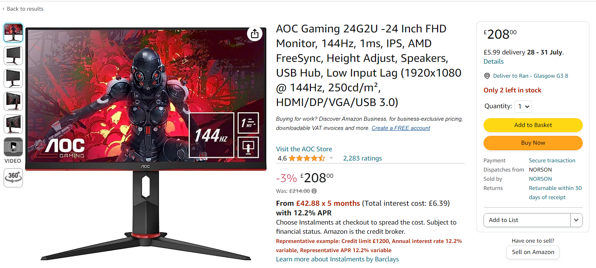
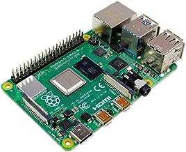
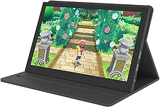
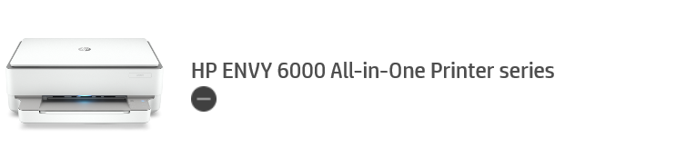
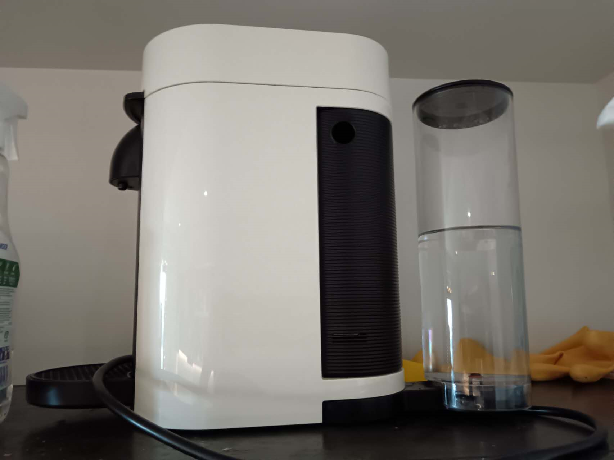
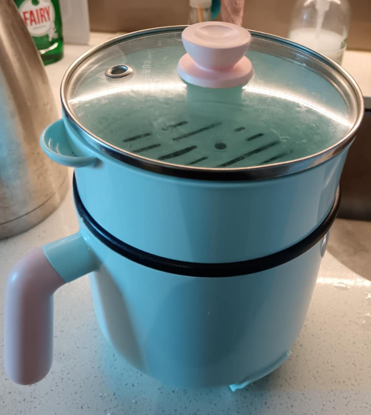

| 物品                                 | 价格             | 无特别注明即下单可拿 |
| ------------------------------------ | ---------------- | -------------------- |
| AOC显示器 24G2U 24寸 144 HZ          | 80Pounds         |                      |
| 树莓派 4B 8GB内存 嵌入式选课需要购买 | 70pounds         |                      |
| 7.5寸便携屏 可用树莓派               | 2个 每个25pounds |                      |
| 2.4G无限键盘 带炫光                  | 10pounds         |                      |
| HP打印机                             | 40pounds         |                      |
| 自动咖啡机(送咖啡)                   | 30Pounds         |                      |
| 中标小煮锅                           | 6pounds          |                      |

- 做毕业设计或者选择嵌入式课程时,需要购买树莓派,早点购买可以早点熟悉使用
- Type-c 供电

- 尺寸比较小,建议做电脑副屏检测电脑CPU信息
- 可做树莓派的屏幕,方便外出携带

- 墨盒余量70%
- 可无线连接到手机,平板,电脑等设备打印

- 使用咖啡胶囊
- 方便快捷

- 小煮锅带蒸屉
- 中标 有电源线